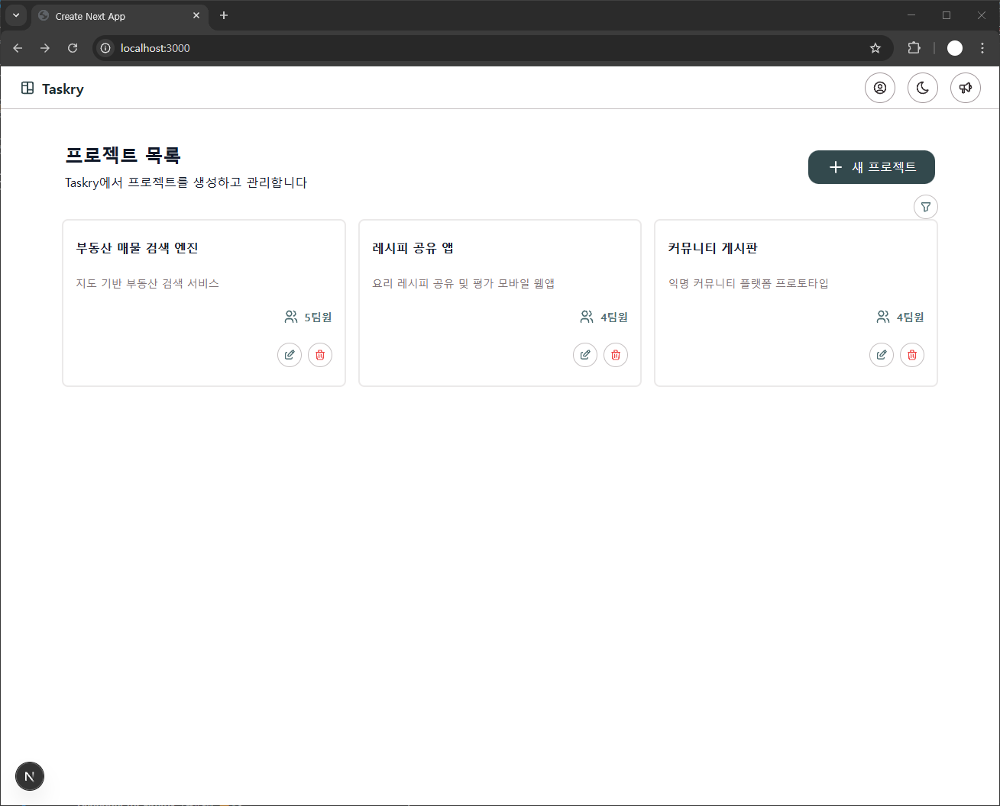
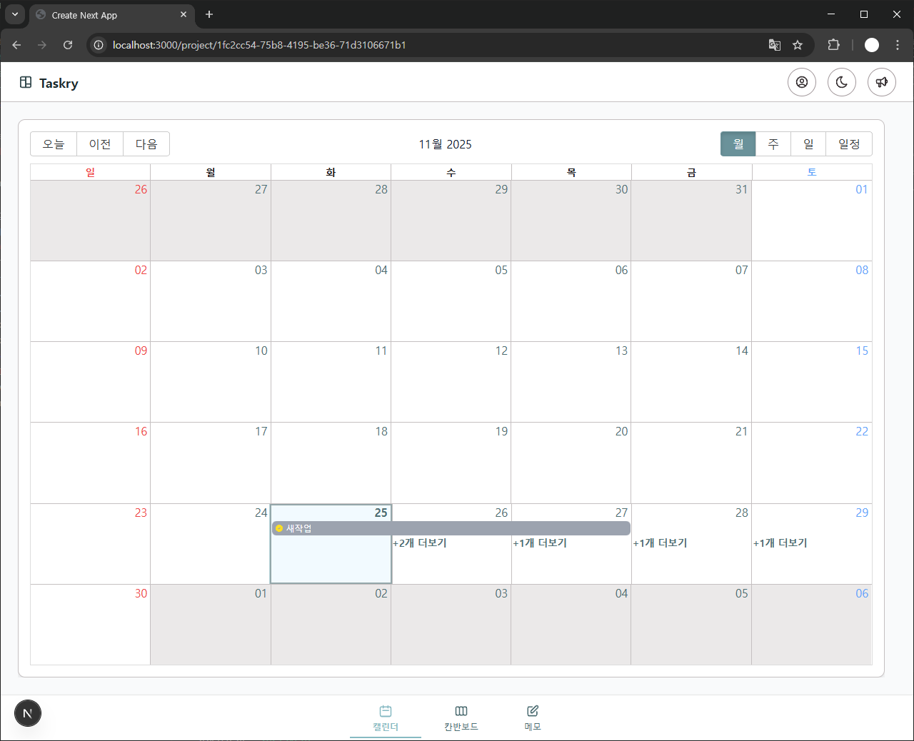
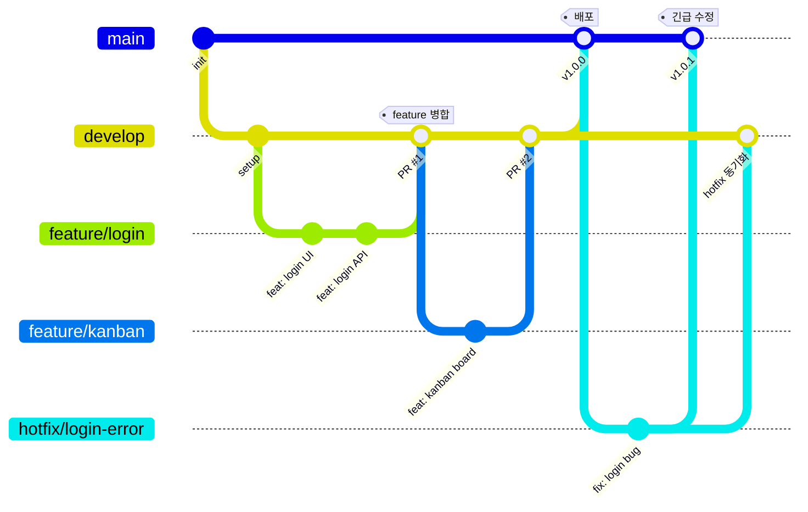

# 🚀 Taskry

> **Team DAN_DA_DAN** Project  
> Next.js 기반의 직관적인 칸반 보드 협업 툴


**Taskry**는 복잡한 절차 없이 누구나 쉽게 업무 흐름을 관리할 수 있는 웹 기반 협업 도구입니다.  
직관적인 UI와 실시간 동기화를 통해 팀의 생산성을 극대화합니다.

## 📸 Screen Shots

|                              메인 대시보드                               |                                  칸반보드                                  |                                 캘린더                                  |
| :----------------------------------------------------------------------: | :------------------------------------------------------------------------: | :---------------------------------------------------------------------: |
|  |  |  |

## 💡 주요 기능 (Key Features)

- **📊 업무 진행 현황의 시각화**

  - 업무 상태(To Do, In Progress, Done)를 단계별로 구분하여 시각적으로 표현합니다.
  - 드래그 앤 드롭 등을 통해 상태를 손쉽게 변경할 수 있습니다. (사용 라이브러리: @dnd-kit)

- **🎨 직관적이고 간결한 UX**

  - 복잡한 학습 없이 즉시 사용 가능한 UI를 제공합니다.
  - 반응형 디자인(Responsive Design)을 적용하여 PC, 태블릿, 모바일 어디서든 접근 가능합니다.

- **🤝 실시간 협업 환경**

  - 팀원의 작업 내역과 상태 변경이 실시간으로 보드에 반영됩니다.
  - Supabase를 활용하여 데이터의 정합성을 유지합니다.

- **📅 유연하고 확장 가능한 일정 관리**
  - 일정 추가/수정/삭제(CRUD) 기능.
  - 팀원 지정, 중요도 설정, 검색 및 필터링을 통해 원하는 정보를 빠르게 찾을 수 있습니다.

## 🛠️ 기술 스택 (Tech Stack)

|      분류       | 기술                     |   버전    | 비고                          |
| :-------------: | :----------------------- | :-------: | :---------------------------- |
|  **Framework**  | **Next.js** (App Router) | `16.0.1`  | React 기반 풀스택 프레임워크  |
|   **Runtime**   | **React**                | `19.2.0`  | 최신 React 19 사용            |
|  **Language**   | **TypeScript**           |   `^5`    | 안정적인 타입 시스템          |
|   **Styling**   | **Tailwind CSS**         |   `^4`    | 유틸리티 퍼스트 CSS           |
|     **DnD**     | **@dnd-kit**             | `^6.3.1`  | 드래그 앤 드롭 기능           |
|  **Auth / DB**  | **Supabase**             | `^2.81.1` | Google OAuth 및 PostgreSQL DB |
|   **Editor**    | **Lexical**              | `^0.38.2` | 리치 텍스트 에디터            |
|    **Date**     | **date-fns**             | `^4.1.0`  | 날짜 유틸리티                 |
|   **Linting**   | ESLint                   |     -     | 코드 품질 관리                |
| **Package Mgr** | npm                      |     -     | 패키지 관리                   |

## 📦 시작 가이드 (Getting Started)

### 1. 저장소 복제

```
git clone https://github.com/Taskry/NextTaskry.git
cd NextTaskry
npm install
```

### 2. 환경 변수 설정

```
# AUTH
NEXTAUTH_URL=your_url
NEXTAUTH_SECRET=your_secret
GOOGLE_CLIENT_ID=your_client_id
GOOGLE_CLIENT_SECRET=your_client_secret

# Database URLs
DATABASE_URL=your_database_url
DIRECT_URL=your+direct_url

# Supabase API
NEXT_PUBLIC_SUPABASE_URL=your_supabase_url
NEXT_PUBLIC_SUPABASE_ANON_KEY=your_supabase_anon_key
```

### 3. 실행 명령어

```
npm run dev
```

브라우저에서 http://localhost:3000으로 접속하여 확인하세요.

## 📁 프로젝트 구조 (Project Structure)

```
src/
├── app/                   # Next.js App Router
│   ├── (main)/            # 메인 사용자 페이지
│   ├── (admin)/           # 관리자 페이지
│   ├── (auth)/            # 인증 페이지
│   ├── api/               # API 라우트
│   ├── data/              # 모의 데이터
│   ├── sample/            # 샘플 페이지
│   ├── layout.tsx         # 루트 레이아웃
│   ├── page.tsx           # 루트 페이지
│   └── globals.css        # 전역 스타일
│
├── components/             # 재사용 가능한 컴포넌트
│   ├── features/          # 도메인별 기능 컴포넌트
│   ├── layout/            # 레이아웃 컴포넌트
│   ├── shared/            # 공용 컴포넌트
│   └── ui/                # UI 기본 컴포넌트
│
├── lib/                   # 유틸리티 및 API
│   ├── api/              # API 호출 함수
│   ├── supabase/         # Supabase 클라이언트
│   ├── constants.ts      # 전역 상수
│   └── utils.ts          # 유틸리티 함수
│
├── types/                 # TypeScript 타입 정의
├── hooks/                 # 커스텀 React 훅
├── providers/             # Context Provider
└── config/                # 설정 파일
```

## 🤝 협업 방식

### 🌿 Git Branch 컨벤션

#### 1. 브랜치 전략 (Branch Strategy)



#### 2. 기본 규칙 (Basic Rules)

| 규칙                  | 설명                                                                    |
| :-------------------- | :---------------------------------------------------------------------- |
| **브랜치 구성**       | `main`, `develop`, `feature/*`, `hotfix/*` 브랜치 사용                  |
| **작업 순서**         | ① `main` → `develop` 생성 ② `develop` → `feature/*` 생성하여 개발       |
| **병합(Merge)**       | PR을 통해 `feature` → `develop` 병합 후, feature 브랜치 삭제            |
| **동기화(Sync)**      | 작업 시작 전 항상 `develop` 브랜치를 `pull` 받아 최신 상태 유지         |
| **배포(Deploy)**      | `develop`에서 개발 완료 시 `main`에 병합하여 배포                       |
| **긴급 수정(Hotfix)** | `main`에서 `hotfix/*` 생성 → 수정 후 `main`과 `develop` **모두에** 병합 |

#### 3. 브랜치 네이밍 규칙 (Naming Convention)

|   타입    | 형식             | 설명             | 실제 사용 예시                                                              |
| :-------: | :--------------- | :--------------- | :-------------------------------------------------------------------------- |
| `feature` | `feature/기능명` | 새로운 기능 개발 | `feature/login`, `feature/kanban-refactor`, `feature/calendar-timeline-add` |
|   `fix`   | `fix/이슈명`     | 버그 수정        | `fix/z-index`, `fix/modal-close`                                            |
|  `style`  | `style/대상`     | 스타일 변경      | `style/calendar-darkmode`                                                   |
|  `chore`  | `chore/작업명`   | 기타 작업        | `chore/remove-duplicate-files`                                              |
|  `docs`   | `docs/문서명`    | 문서 작업        | `docs/readme`                                                               |
|   `dev`   | `dev/작업자`     | 개인 개발 브랜치 | `dev/nelee`                                                                 |

> 💡 **규칙**: 모두 **소문자**로 작성하며, 단어 구분은 **하이픈(-)**을 사용합니다.

<details>
<summary><b>📋 실제 사용된 브랜치 목록 (클릭하여 펼치기)</b></summary>

```
# Feature 브랜치
feature/login
feature/admin
feature/invite
feature/kanban-manager
feature/kanban-refactor
feature/calendar-kanban-memo
feature/calendar-timeline-add
feature/design-system
feature/notice
feature/project

# Style 브랜치
style/calendar-darkmode

# Fix 브랜치
fix/z-index

# Chore 브랜치
chore/remove-duplicate-files
```

</details>

### 📝 Git Commit 컨벤션

#### 1. 커밋 메시지 구조

```text
[type] : subject

body

footer
```

#### 2. Commit Type (태그)

|     태그     | 설명                                                                   |
| :----------: | :--------------------------------------------------------------------- |
|   `[feat]`   | 새로운 기능을 추가할 경우                                              |
|   `[fix]`    | 버그를 고친 경우                                                       |
|  `[design]`  | CSS 등 사용자 UI 디자인 변경                                           |
|  `[style]`   | 코드 포맷 변경, 세미콜론 누락, 코드 수정이 없는 경우                   |
| `[refactor]` | 코드 리팩토링할 경우                                                   |
| `[comment]`  | 필요한 주석 추가 및 변경                                               |
|   `[docs]`   | 문서를 수정한 경우                                                     |
|  `[chore]`   | 빌드 테스트 업데이트, 패키지 매니저 설정 (소스코드를 건들지 않는 작업) |
|  `[rename]`  | 파일 혹은 폴더명을 수정하거나 옮기는 작업만 하는 경우                  |
|  `[remove]`  | 삭제하는 작업만 수행한 경우                                            |
|   `[init]`   | 브랜치 초기화 및 초기 셋팅 관련된 설정일 경우                          |
|  `[build]`   | 빌드 파일 수정                                                         |
|    `[ci]`    | CI 설정 파일 수정                                                      |
|   `[perf]`   | 성능 개선                                                              |

#### 3. 작성 규칙

**① Subject Rule (제목)**

- 제목은 최대 **50글자**가 넘지 않도록 하고, 마침표 및 특수기호는 사용하지 않습니다.
- 영문 사용 시, **동사 원형**을 사용하고 첫 글자는 **대문자**로 표기합니다. (과거 시제 금지)
- 제목은 **개조식 구문**으로 작성합니다. (완전한 서술형 문장이 아닌, 간결하고 요점적인 서술)

**② Body Rule (본문)**

- 본문은 한 줄 당 **72자 내**로 작성합니다.
- 내용은 양에 구애받지 않고 최대한 **상세히** 작성합니다.
- 어떻게 변경했는지보다 **'무엇을', '왜'** 변경했는지를 설명합니다.

**③ Footer Rule (꼬리말)**

- 꼬리말은 **선택 사항(Optional)**이며, 이슈 트래커 ID를 작성합니다.
- 형식: `"유형: #이슈 번호"` (여러 개일 경우 쉼표로 구분)
- **이슈 트래커 유형**:
  - `Fixes`: 이슈 수정 중 (아직 해결되지 않은 경우)
  - `Resolves`: 이슈를 해결했을 때 사용
  - `Ref`: 참고할 이슈가 있을 때 사용
  - `Related to`: 해당 커밋에 관련된 이슈 번호 (아직 해결되지 않은 경우)

#### 4. 작성 예시

```
[feat] : 추가 get data api 함수

로그인 API 개발

Resolves: #123
Ref: #456
Related to: #48, #45
```

### 🎨 Code 컨벤션

#### 1. 네이밍 규칙 (Naming Convention)

**사용하는 네이밍 종류**

- `PascalCase` (파스칼 케이스)
- `camelCase` (카멜 케이스)
- `kebab-case` (케밥 케이스)
- `snake_case` (스네이크 케이스)

**명명 규칙 상세**

- **변수 및 함수**: `camelCase` 사용
- **Boolean**: `is` 접두사 사용
- **배열(Array)**: `List` 접미사 사용
- **상수(Constant)**: 영문 대문자, `SNAKE_CASE` 사용
- **이벤트 핸들러**: `handle` 접두사 사용
- **Fetch 함수**: HTTP Method(`get`, `post`, `put`, `del`)로 시작

```javascript
const userName = "Alice";
const userAge = 30;

// Boolean
const isLoggedIn = true;

// 배열 (List 접미사)
const dataList = [10, 20, 30];

// 상수 (대문자 Snake 표기법)
const NAME_ROLE = "Alice";

// 이벤트 핸들러 (handle 접두사)
const handleClick = () => {};
const handleChange = () => {};

// Fetch 함수 (Method로 시작)
const getDataList = () => {...}
const postDataList = () => {...}
const putDataList = () => {...}
const delDataList = () => {...}
```

#### 2. 컴포넌트 구조 및 포맷팅

Props 정렬

- 여러 줄 Props: Props가 많거나 길 경우, 각 prop을 별도의 줄에 작성하고 들여쓰기하여 가독성을 높입니다.

```html
<MyComponent propA="valueA" propB={someVariable} propC={() =>
console.log("clicked")} />
```

블록 구문 (Block Syntax)

- 한 줄짜리 블록일 경우라도 중괄호 {}를 생략하지 않고 명확히 줄 바꿈하여 사용합니다.

```javascript
// ❌ 나쁜 예시
if (true) return "hello";

// ✅ 좋은 예시
if (true) {
  return "hello";
}
```

#### 3. 파일 및 폴더 구조 (Files & Folders)

- 폴더명: camelCase를 사용합니다.
- 파일명:
  - 컴포넌트, 클래스 파일: PascalCase (.jsx, .tsx)
  - 일반 JS 파일 (service, config 등): camelCase (.js, .ts)

```
// 컴포넌트 파일
Header.jsx
Menu.jsx

// Service 파일
authSignUp.js
authGoogleSignin.js

// Config 파일
firebase.js
firebaseError.js
```

#### 4. 스타일링 (Style)

- 일관성 유지: CSS Modules, Styled Components, Tailwind CSS 등 어떤 방식을 사용하든 프로젝트 전체에서 통일된 규칙을 따릅니다.
- 인라인 스타일 지양: 특별한 이유가 없다면 style 속성을 직접 사용하는 인라인 스타일은 피합니다.

```html
// 나쁜 예시
<div style={{ color: 'red', fontSize: '16px' }}>Hello</div>

// 좋음 예시 (CSS 클래스 사용)
<div className="text-red-16">Hello</div>
```

                                                                                                                                                                                            |
| :------------------------------------------------------: | :--------: | :-------------------: | :-------------------------------------------------------------------------------------------------------------------------------------------------------------------------------------------------------- |
|  | **이남은** | Frontend<br>Team Lead | • **칸반 보드:** dnd-kit 기반 카드 Drag & Drop 및 상태 동기화<br>• **캘린더:** 월/주/일 단위 일정 시각화 및 Task 필터링 구현<br>• **데이터 연동:** 보드와 캘린더 간 실시간 데이터 반영 로직               |
|  | **김민중** |       Frontend        | • **디자인 시스템:** 전체 UI 톤앤매너 정립 및 공통 컴포넌트 설계<br>• **UI 퍼블리싱:** 반응형 레이아웃 구현 및 CSS 스타일링 최적화<br>• **관리자 대시보드:** 관리자 전용 페이지 UI 및 시스템 설정 뷰 개발 |
|  | **이원찬** |       Frontend        | • **인증/보안:** JWT 기반 로그인·회원가입 및 프라이빗 라우트 처리<br>• **멤버 관리:** 사용자 권한(Role) 제어 로직 구현<br>• **초대 시스템:** 워크스페이스 팀원 초대 및 멤버 리스트 관리                   |
|  | **이현수** |       Frontend        | • **프로젝트 관리:** 워크스페이스 생성·수정·삭제(CRUD) 프로세스<br>• **환경 설정:** 프로젝트별 메타데이터 관리 및 세부 옵션 제어<br>• **목록 관리:** 프로젝트 타입별 필터링 및 시간순 정렬 로직 구현      |


🙏 감사합니다

이 프로젝트에 관심을 가져주셔서 감사합니다!
